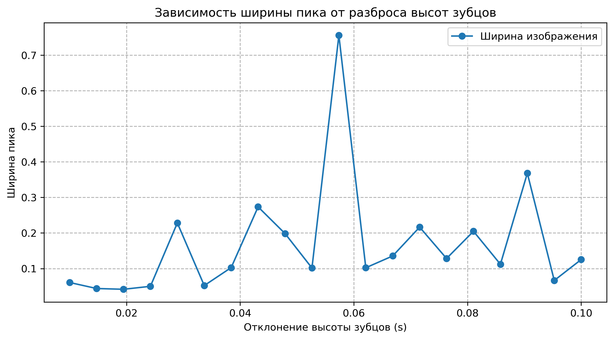

# Зависимость ширины пика от разброса высот зубцов

| s | width |
|---|---|
| 0.010 | 0.060779 |
| 0.015 | 0.043872 |
| 0.019 | 0.041666 |
| 0.024 | 0.050040 |
| 0.029 | 0.228251 |
| 0.034 | 0.052142 |
| 0.038 | 0.102703 |
| 0.043 | 0.273479 |
| 0.048 | 0.198475 |
| 0.053 | 0.101513 |
| 0.057 | 0.755803 |
| 0.062 | 0.102245 |
| 0.067 | 0.135438 |
| 0.072 | 0.216466 |
| 0.076 | 0.128305 |
| 0.081 | 0.204818 |
| 0.086 | 0.112042 |
| 0.091 | 0.368093 |
| 0.095 | 0.066493 |
| 0.100 | 0.125294 |

